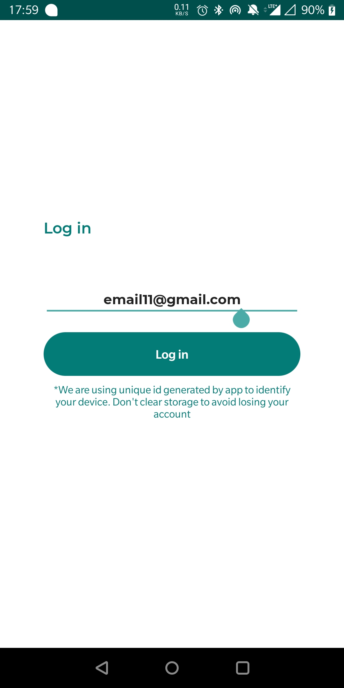
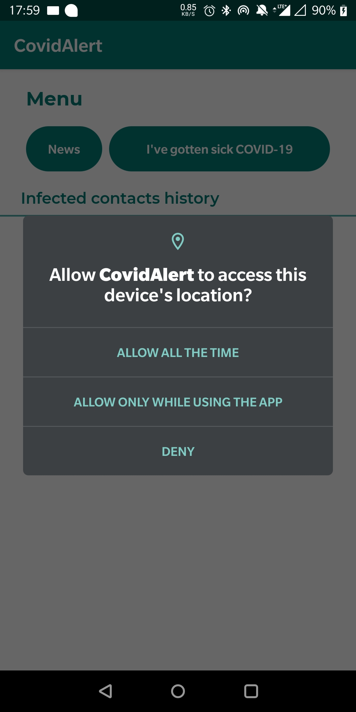
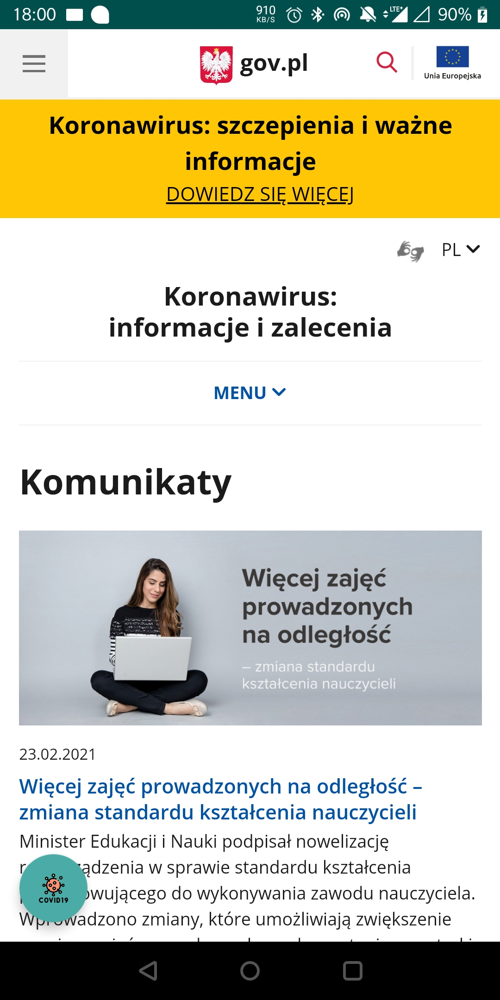
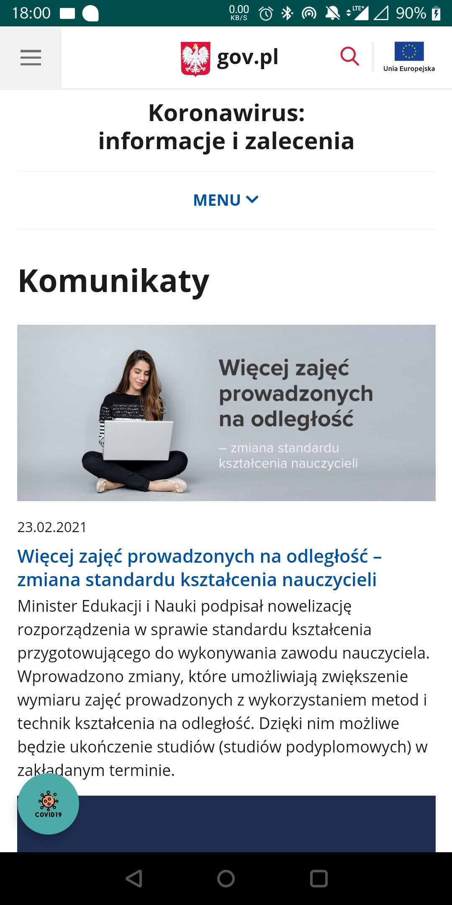
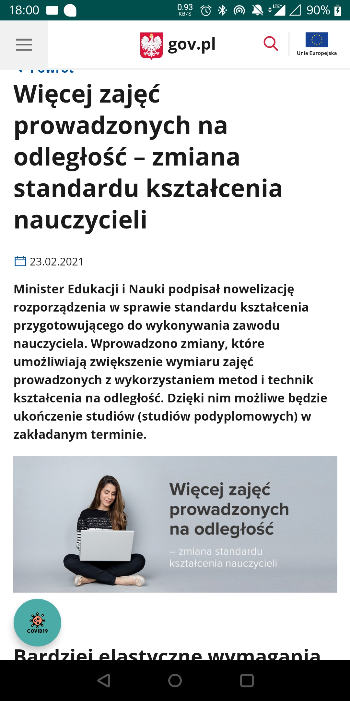
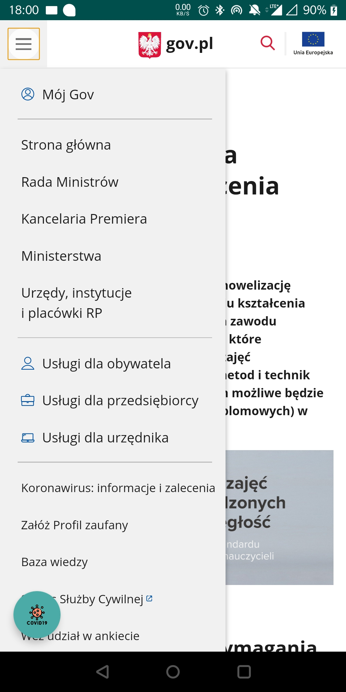
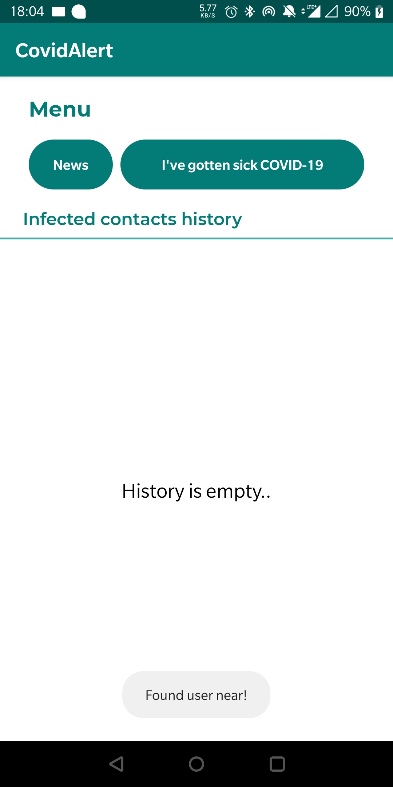
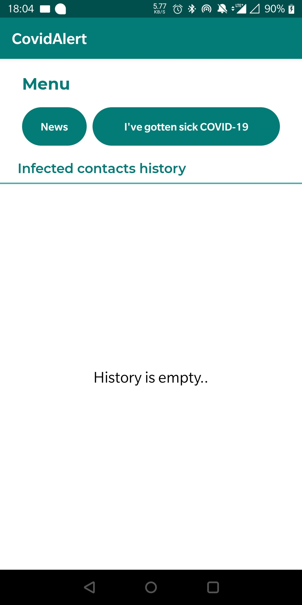
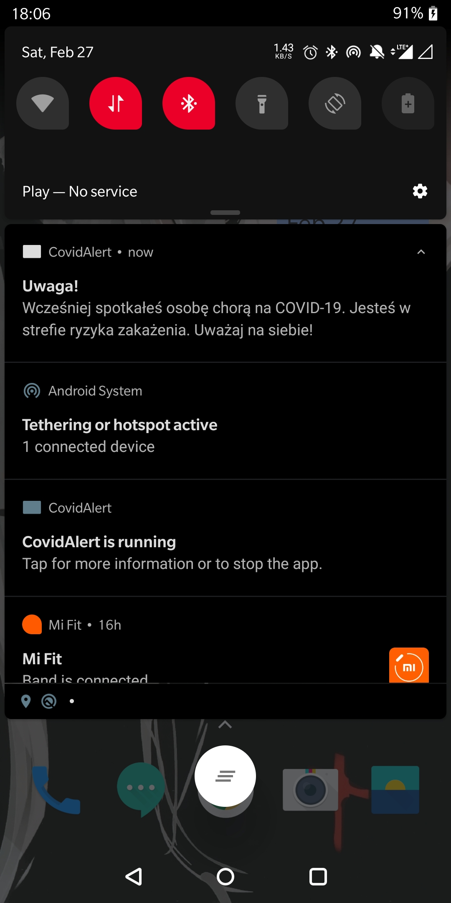
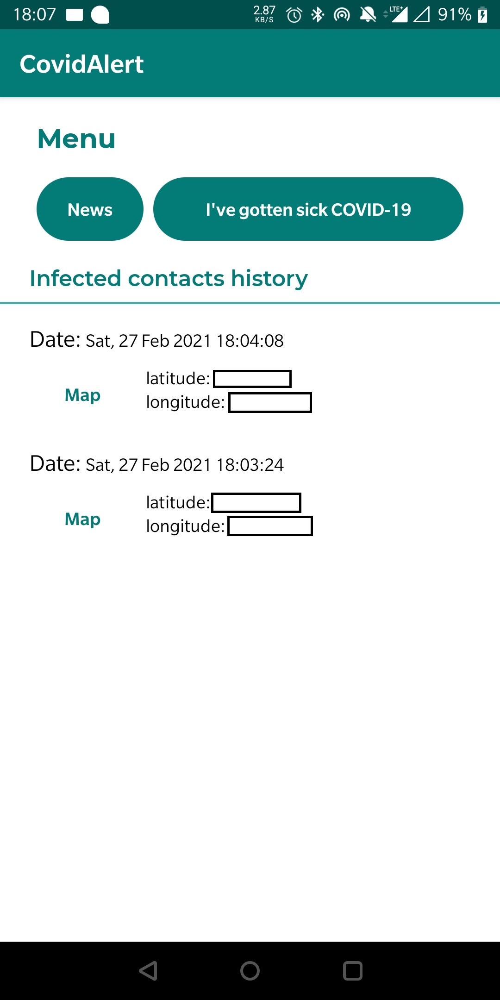

# CovidAlert
The app will detect contacts between users using Google Nearby Messages. If the user got sick, he will able to inform others users about it using a special dialog. Affected users will be notified with Android notification (FCM). In any moment, user can view the history of his infected contact and check the place where it happend (if there is such data).
## TODO:
- Add more UseCases instead of calling Repositories directly
- Add list pagination (PagedListAdapter?)
## Screenshots

